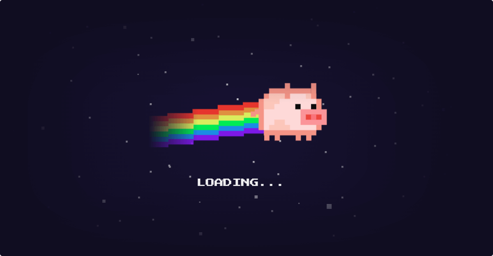
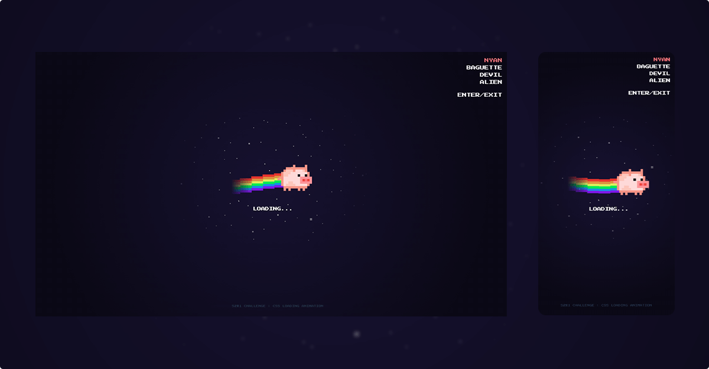

# [Nyan Pig - Loading animation](https://aelweak.github.io/nyanpig/)

## Challenge details

-   **Brief :** Create a loading animation
-   **Start :** Aug 1 (9.13 am), 2022
-   **End :** Aug 14 (11.59 pm), 2022
-   **Results :** 🥇1st place (out of 13)

<a href="https://discord.com/channels/655077317911117860/809723196185903124/1003561158093049887" target="_blank">(More details on Discord)</a>

## Description/Features

Nyanyanyanyanyanyanya ! 🌈 🐷

I really had fun on this challenge and hope it will make you smile.  
Especially with those "little features" :

-   Skin choices  
    Feel free to add/code your own rainbow and pig skins...
    Just look for `$skins`, `$rainbow` (`style.scss`), add/name your own object(s) in it, then add new skin(s) "button" (`index.html`, see commented template)
-   Enable/Disable the pig entrance with _"Enter/Exit"_ button
-   Set the speed (`$flying-speed`) or movement distance/height (`$flying-height-distance`)
-   And... Completely useless, therefore essential : click on the pig ! (❤️)

# Preview(s)

